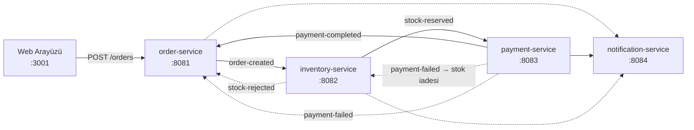

# Supply Chain Saga

Dağıtık sipariş ve envanter yönetimi için **olay güdümlü (event-driven) mikroservis** sistemi.
Dört Spring Boot servisi birbirini doğrudan çağırmaz; yalnızca Kafka üzerinden olay alışverişi
yapar. Dağıtık işlem tutarlılığı **Saga (choreography)** deseniyle, hata durumunda geri alma ise
**telafi işlemiyle (compensating transaction)** sağlanır.

Sistemin tamamı tek komutla ayağa kalkar ve **canlı bir web arayüzünden** izlenebilir:
sipariş verdiğinizde olayların servisler arasında nasıl aktığını adım adım görürsünüz.

```bash
docker compose up --build     # ardından http://localhost:3001
```

---

## Nasıl çalışır



Mutlu yol ve telafi senaryosu:

| # | Olay | Üreten | Tüketen | Sonuç |
|---|---|---|---|---|
| 1 | `order-created` | order-service | inventory-service, notification-service | Sipariş `PENDING` |
| 2 | `stock-reserved` | inventory-service | payment-service, order-service | Stok düşülür |
| 3 | `payment-completed` | payment-service | order-service, notification-service | Sipariş tamamlanır |
| — | `stock-rejected` | inventory-service | order-service, notification-service | Stok yetersiz → sipariş iptal |
| — | `payment-failed` | payment-service | inventory-service, order-service | **Telafi:** rezerve stok iade edilir |

Ödeme başarısız olduğunda `inventory-service` stoğu geri yükler — saga'nın telafi adımı budur.

## Servisler

| Servis | Port | Veritabanı | Sorumluluk |
|---|---|---|---|
| order-service | 8081 | `orders_db` | Sipariş yaşam döngüsü, saga başlatıcı |
| inventory-service | 8082 | `inventory_db` | Stok rezervasyonu ve iadesi |
| payment-service | 8083 | `payments_db` | Ödeme işlemleri |
| notification-service | 8084 | `notifications_db` | Olay bazlı bildirimler |
| frontend | 3001 | — | Canlı mimari diyagramı (React + nginx) |

## Altyapı

| Bileşen | Port | Kullanım |
|---|---|---|
| PostgreSQL | 5432 | Her servis için ayrı şema/veritabanı |
| Redis | 6379 | Önbellek + dağıtık kilit |
| Kafka (KRaft) | 9094 | Olay akışı |
| Kafka UI | 8080 | Topic ve mesaj izleme |
| Prometheus | 9090 | Metrik toplama |
| Grafana | 3000 | Panolar (`admin` / `admin`) |
| Zipkin | 9411 | Dağıtık izleme (tracing) |

## Teknoloji yığını

**Backend:** Java 25 · Spring Boot 3.5 · Spring Kafka · Spring Data JPA · Redis · PostgreSQL · Lombok
**Frontend:** React 19 · TypeScript 5.7 · Vite 6 · Tailwind CSS · nginx (reverse proxy)
**Altyapı:** Docker Compose · Kubernetes · GitHub Actions · Testcontainers · JaCoCo

---

## Hızlı başlangıç

**Gereksinimler:** Docker & Docker Compose. (Yerel geliştirme için ek olarak JDK 25 ve Maven 3.8+.)

```bash
git clone https://github.com/baymertozturk/supply-chain-saga-project.git
cd supply-chain-saga-project
docker compose up --build
```

Komut; 4 mikroservisi, web arayüzünü, PostgreSQL'i (4 ayrı veritabanı), Redis'i, Kafka'yı ve
izleme araçlarını ayağa kaldırır. Servisler altyapı `healthy` olana kadar bekler.

Sonra tarayıcıda **<http://localhost:3001>** — "Örnek Sipariş Ver" butonuna basıp olay akışını
canlı izleyebilirsiniz.

| Arayüz | Adres |
|---|---|
| **Web arayüzü** | <http://localhost:3001> |
| Kafka UI | <http://localhost:8080> |
| Grafana | <http://localhost:3000> |
| Prometheus | <http://localhost:9090> |
| Zipkin | <http://localhost:9411> |

Durdurmak için:

```bash
docker compose down       # konteynerleri durdur
docker compose down -v    # verileri de sil, sıfırdan başla
```

> **Windows notu:** Projeyi ASCII karakterli bir yola klonlayın. Docker Compose çoklu servis
> build'inde oturum anahtarını dizin adından türetir; yolda Türkçe karakter varsa build başarısız
> olur. Ayrıntı: [docs/TESTING.md](docs/TESTING.md) §7

## API'yi doğrudan kullanma

```bash
# Sipariş oluştur
curl -X POST http://localhost:8081/orders \
  -H "Content-Type: application/json" \
  -d '{"customerId":"CUST-1","productId":"PROD-1","quantity":2}'

# Siparişin durumunu sorgula
curl http://localhost:8081/orders/{id}

# Stok durumunu gör
curl http://localhost:8082/products/PROD-1
```

Sipariş durumu `PENDING` → `STOCK_RESERVED` → `PAYMENT_COMPLETED` şeklinde ilerler; stok veya
ödeme adımı başarısız olursa `FAILED` olur.

## Geliştirme

Yalnızca altyapıyı konteynerde tutup servisleri IDE'den çalıştırmak için:

```bash
docker compose up -d postgres redis kafka kafka-ui
cd order-service && mvn spring-boot:run
```

Web arayüzünü ayrı çalıştırmak için: [frontend/README.md](frontend/README.md)

## Test

```bash
mvn clean test
```

30 test çalışır (birim + Testcontainers ile entegrasyon). JaCoCo kapsam raporu:
`*/target/site/jacoco/index.html`. Uçtan uca test sonuçları, bulunan hatalar ve bilinen kısıtlar
için: **[docs/TESTING.md](docs/TESTING.md)**

## Kubernetes (opsiyonel)

```bash
kind create cluster --name supply-chain
kind load docker-image --name supply-chain \
  supply-chain-order-service:latest supply-chain-inventory-service:latest \
  supply-chain-payment-service:latest supply-chain-notification-service:latest
kubectl apply -f k8s/
```

Manifestler, probe tasarımı ve adım adım anlatım: **[k8s/README.md](k8s/README.md)**

## Proje yapısı

```
├── order-service/         # Sipariş yönetimi, saga başlatıcı
├── inventory-service/     # Stok rezervasyonu + telafi
├── payment-service/       # Ödeme işlemleri
├── notification-service/  # Bildirimler
├── frontend/              # React + Vite arayüz (nginx ile sunulur)
├── k8s/                   # Kubernetes manifestleri
├── docker/                # Postgres init, Prometheus yapılandırması
├── docs/TESTING.md        # Uçtan uca test raporu
├── docker-compose.yml     # Tüm sistem tek dosyada
└── pom.xml                # Parent (aggregator) POM
```
